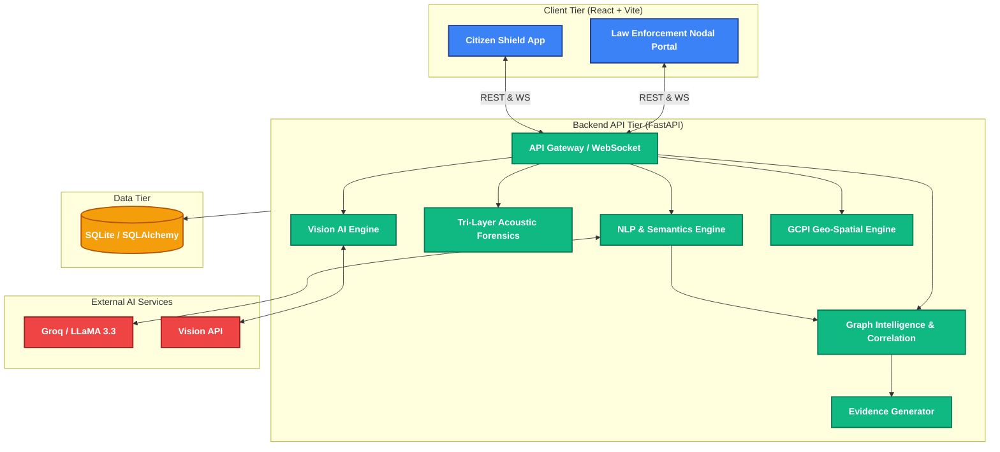

<div align="center">

# 🛡️ Sentinel
**India's Proactive AI Fraud Interdiction System**

[](#)
[](#)
[](#)
[](#)

*Detect, classify, and respond to fraud as it happens — in under 2 seconds.*

[Explore Features](#-core-capabilities) · [Architecture](#-architecture) · [Getting Started](#-quick-start)

</div>

---

## ✦ The Vision
Current systems react *after* the crime. Sentinel sits directly between scammers and citizens, acting as a real-time, AI-driven shield against Digital Arrest scams, vishing, UPI fraud, and counterfeit currency.

## ✦ Core Capabilities

### For Law Enforcement (Nodal Portal)
- **Live Threat Dashboard:** Real-time AI-intercepted scam calls with risk profiles and 1-click countermeasures.
- **Counterfeit Currency Scanner:** Deep AI Vision forensics for microprinting, security threads, and watermarks.
- **Graph Intelligence:** Interactive, force-directed mapping of scammer infrastructure and money mule networks.
- **Live Command Centre (GCPI):** Near real-time geospatial intelligence featuring H3 hexbins, Getis-Ord Gi* hotspots, and predictive patrol allocation.
- **Evidence Engine:** Auto-generated, court-admissible evidence dossiers with SHA-256 integrity hashing.

### For Citizens (Citizen Shield)
- **Live Call Shield:** Real-time transcriptions & AI threat alerts (Safe / Warning / Critical) directly during calls.
- **AI Fraud Assistant:** Multi-lingual conversational AI for analyzing SMS, links, and drafting NCRB complaints.

## ✦ System Architecture

Sentinel fuses modern frontend tooling with powerful, low-latency AI inference through a split-stream architecture.



### Architecture Details

1. **Client Tier**: 
   - **Citizen Shield** records ambient audio via the Web Speech API and MediaRecorder, instantly sending raw data over WebSocket.
   - **Nodal Portal** features React-Leaflet maps for geo-spatial intelligence and interactive force-directed graphs for threat correlation.
2. **Backend API Tier (FastAPI)**: Uses a Split-Stream ingestion model. 
   - **Lane 1 (Semantics)** analyzes transcribed speech for fraud scripts and extracts named entities using Groq.
   - **Lane 2 (Acoustics)** runs an ensemble model to detect deepfakes by analyzing voice biomechanics, spectral flatness, and Wav2Vec2 features.
3. **Core Intelligence Engines**: 
   - **Graph Intelligence**: Correlates newly extracted entities against known Sybil rings and calculates centrality scores to track money mule networks.
   - **GCPI Engine**: Generates predictive geo-spatial hexbins (H3) and identifies emerging threat clusters in real-time.
4. **Data Tier**: Stores incidents, entities, graph relationships, and geospatial events in SQLite, managed through SQLAlchemy ORM.

## ✦ Quick Start

**1. Clone & Configure**
```bash
git clone https://github.com/GhoshChinmay/project-sentinel.git
cd project-sentinel
```
Add your Groq API key to `backend/.env`:
```env
GROQ_API_KEY=your_key_here
```

**2. Launch Backend**
```bash
cd backend
python -m venv venv
venv\Scripts\activate
pip install -r requirements.txt
uvicorn main:app --reload
```

**3. Launch Frontend**
```bash
cd frontend
npm install
npm run dev
```

## ✦ Roadmap
- [x] Phase 0: Live AI scam call detection & Counterfeit scanner
- [x] Phase 1: Graph intelligence & Correlation engine
- [x] Phase 2: Live Geospatial Command Centre (GCPI)
- [ ] Phase 3: Real telecom API integration (TRAI sandbox)
- [ ] Phase 4: Bank freeze API integration (NPCI/UPI)
- [ ] Phase 5: Multi-state deployment architecture

---
<div align="center">
Built with ❤️ for a safer India.
</div>
